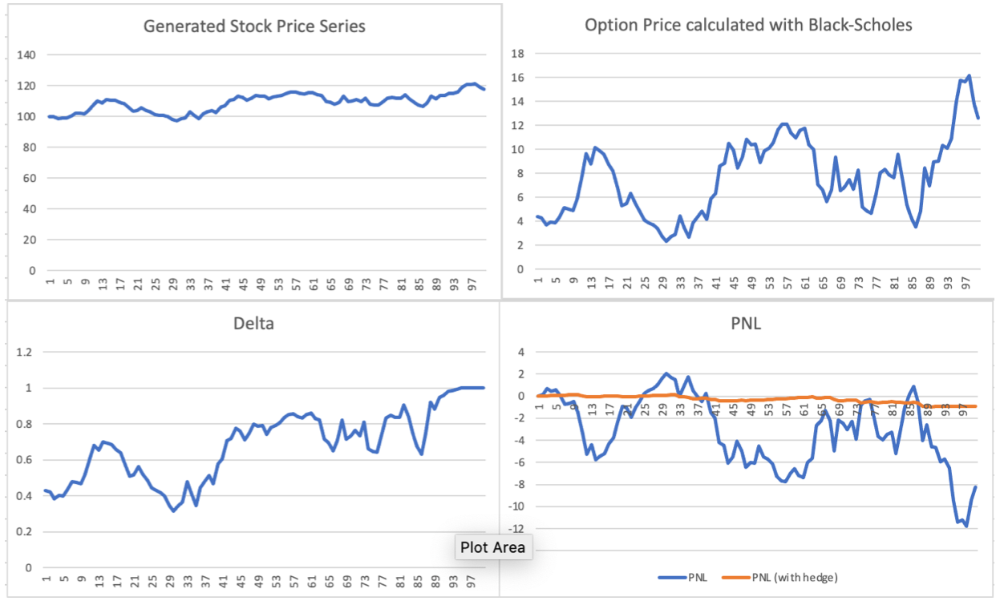

# Dynamic Delta Hedging Strategy Implementation

The purpose of this project was to implement a Dynamic Delta Hedging strategy for European Options in C++. Delta Hedging is a great strategy for trying to create a neutral portfolio to minimize risk exposure.

### Folder Structure:

To run this program, you need to have a C++11 compiler installed as well as the _boost_ and _quantlib_ libraries.

Folder Structure:
- /bin: compiled executable files
- /data: input data files for Part II
- /doc: documentation files
- /include: .h header files
- /results: output csv files
- /src: .cpp files
- makefile: makefile to compile and run the programs

### Running the Program:

Before compiling and running the program, you should make sure that the paths in "makefile" reflect the ones in your machine. If you are using a Mac, these are the commands to compile and run the program: 

```make``` (compile main file)

```make run``` (run main file)

```make compile_test``` (compile unit test) 

```make run_test``` (run compiled unit test)


### C++ Classes:

For this project, I implemented 3 main classes:
- **option**: this is a generic option class
- **black_scholes**: this class inherits the option class and adds functionality specific to the black scholes model
- **stock**: this class was implemented to generate stock prices using the following formula:

<p align="center">
  
</p>

### Output Example:

- For Part I of the project, I implemented the hedging strategy 1000 different times.
The outputs can be found in the results folder. Here are the plots for one of those strategies:

<p align="center">
  
</p>

- The output for Part II is also in the results folder.
